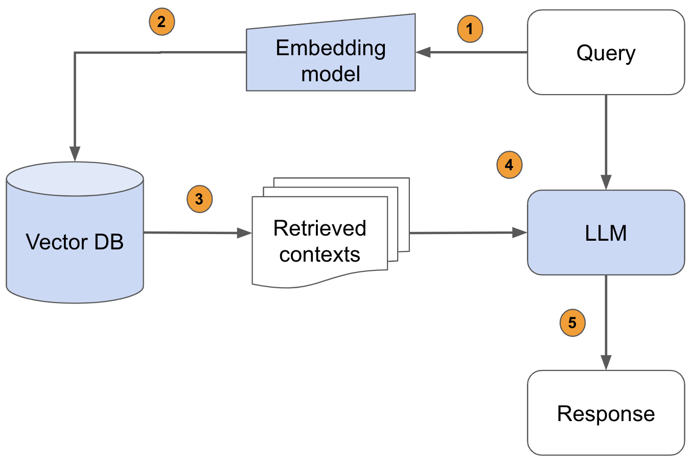

# ServiceTitan Internship Round 2

### Lilit Galstyan

**Retrieval-Augmented Generation (RAG) is a workflow that combines the strengths of information retrieval and generative AI to enhance the accuracy and relevance of generated content. The main objective of RAG is its capability to retrieve external information that is provided to the large language model, which is an advantage over traditional models that solely rely on the data on which they are trained on.**

### 1. Description of RAG

As presented in the image above, there are several components in the RAG workflow that lead to the final generated output. After initializing the embedding model, the question that is asked to the chatbot (the query) is passed to the embedding model, turning the query into a vector representation. On the other hand, the information that must be later retrieved is loaded and split into text chunks using the relevant document processor, and is passed to an initialized vector database, storing the data in vector respresentation again through the same embedding model. After these, the vector query is passed into the vector database, where the retriever tool performs similarity search and finds relevant data snippets based on the input query. These retrieved pieces of information are then passed into a generative model (the LLM), which uses that data, as well as given instructions, to produce an accurate and contextually relevant output by converting the vectors back into human language.

### Component selection

* **Embedding model:**

&nbsp;&nbsp;&nbsp;&nbsp;&nbsp;&nbsp; To use a certain embedding model, a token or an API key are usually required, and some some services are not free-of-charge. Let's consider the case where the cost of the models used is not significant. In this case, a quite well-known embedding model is the **OpenAI Embeddings**, which is widely used in RAG applications and overall in text generation projects. For this, an OpenAI API key is necessary to access the embedding model. An exact embedding model can be specified, such as *text-embedding-3-small* or *text-embedding-3-large*, or a general embedding model can be chosen by initializing it as OpenAIEmbeddings() without any parameters. Due to OpenAI's major advancements, their embeddings work very well for vectorization and vector search.

* **PDF processor:**

&nbsp;&nbsp;&nbsp;&nbsp;&nbsp;&nbsp; A document processor, in this case, should be a PDF processor, as the information being stored in the database is in a .pdf format document. To process the PDF documents, an great option is to use the **pypdf** library which is used for splitting, cropping, merging, and transforming the PDF documents, in general. The **PyPDFLoader()** class from the library can be used by taking the .pdf file name as an argument, then loading and splitting the the content of the document using its .load_and_split() function. Note that this method usually splits the information by the pages of the document.

* **Vector DB:**

&nbsp;&nbsp;&nbsp;&nbsp;&nbsp;&nbsp; A relatively new but popular vector database that can be used to store the chunks of information is **FAISS** from the faiss library (Facebook AI Similarity Search), which is especially efficient in performing the search as it contains various algorithms. FAISS is also an efficient option as it is optimized for memory usage and speed. 

* **Large language model:**

&nbsp;&nbsp;&nbsp;&nbsp;&nbsp;&nbsp; As an efficient LLM, it is best to use a **GPT-4 model**. Everyone most probably knows about the latest advancements of OpenAI and its GPT models, not to mention the fact that GPT-4 is possibly trained on one trillion parameters which increases the model's advanced reasoning and formatting abilities. Coming from my personal experience, using the *gpt-4-turbo-preview* is a great choice when it comes to LLMs and text generation. Nevertheless, to be fair, it is not recommended to use a GPT-3 or GPT-3.5 model, as the performance is quite down; more specifically, the asnwers of the chatbot are not formed well and sometimes even the information is not correctly retrieved.

### 2. Challenges

In spite of the great performance that the above mentioned tools provide, there are certain challenges regarding those. The main two challenges that are encountered are: the embedding model, and the LLM. Why? Because both of them are not open-source. Therefore, if the chatbot is a long-term project, that is, it is going to be used for a long time, and is going to have a large amount of users, then it is going to be difficult to keep up with the payments due to the high pricing of tokens. 

The solution that suites these obstacles is simple: using open-source models. But it is important to know which.

* **Embeddings:**

&nbsp;&nbsp;&nbsp;&nbsp;&nbsp;&nbsp; As an open-source alternative to the OpenAI embeddings, the HuggingFace embeddings is nice to consider. These embeddings are a grat option as their performance does not fall much behind the OpenAI embeddings, and, moreover, these are free of charge. To access the embedding models, it is only required to create a HuggingFace token, which does not cost anything.

* **LLM:**

&nbsp;&nbsp;&nbsp;&nbsp;&nbsp;&nbsp; Although the mentioned GPT-4 model tops with its performance, there are still several well-performing open-source models that can be used as alternatives. One such example, which I have personally used and liked, is one of the new Llama-3 models, more specifically the *Meta-Llama-3-8B-Instruct*. Even though a huge difference of the number of parameters in the mentioned Llama and GPT models is shown, the Llama model does not fall back from GPT, considering that it performs well in understanding and retrieving the relevant information. However, one drawback is that it does not generate comprehensive answers to the question (query) provided to it.

Besides these obstacles, there is one more challenge that might be faced during the process. The chatbot may sometimes provide wrong answers or irrelevant information when a question is asked not concerning the data that the RAG works with. For example, if the chatbot is designed to work as a business consultant, it may provide wrong answers when a question about a university course is asked. This is because the chatbot does not have access to information besides the data provided to it.

The solution to this problem is to be precise with the instructions to the LLM. Of course, the LLM will try its best to answer any question, however to keep the chatbot professional and prone to its objective, it is important to provide certain instructions to the model, including a precise order to not answer questions which cannot be answered based on the given data. That way, the model hallucinations will be prevented.

### 3. Question examples

***Question that the chatbot will be able to answer:***

**1. "What are some safety precautions I should consider when installing the air conditioner?"**

The chatbot can retrieve relevant safety information from the safety precautions and installation manual sections and generate a detailed response.

**2. "How do I connect the refrigerant piping securely?"**

There are specific instructions about refrigerant piping that can be extracted and explained.

**3. "What is the next step after measuring the supply voltage to perform a trial operation and testing?"**

The chatbot can outline the steps involved in the trial operation and testing as described in the manual.

**4. "Can you explain how to set different addresses for indoor units?"**

As detailed instructions for setting addresses for indoor units are provided, this question can be answered.

**5. "How should the mounting plate be installed on a wall?"**

The chatbot can describe the installation process for the mounting plate as mentioned in the file.

***Questions that the chatbot will fail to answer:***

**1. "What is the weather like today?"**

The chatbot is not designed to access real-time data or provide weather updates as it only works with the provided information in pdf files.

**2. "Can you suggest a good restaurant nearby?"**

The chatbot is specialized for installation manuals and does not have access to location-based services.

**3. "What's the latest news on technology?"**

As much as it will try to link technology to installation manuals, the chatbot still does not have access to current news sources and cannot provide information on overall technology.

**4. "Who won the game last night?"**

Again, the chatbot does not have access to this information.

**5. "How do I code a machine learning model in Python?"**

While the chatbot can handle installation manual queries, it is not equipped to provide coding tutorials as it is instructed to specialize in the information provided.

*

**External resources I have used:**

[OpenAI Embeddings](https://platform.openai.com/docs/guides/embeddings)

[PyPDFLoader](https://python.langchain.com/v0.1/docs/modules/data_connection/document_loaders/pdf/)

[FAISS](https://engineering.fb.com/2017/03/29/data-infrastructure/faiss-a-library-for-efficient-similarity-search/)

[GPT-3.5 VS GPT-4](https://techcommunity.microsoft.com/t5/ai-azure-ai-services-blog/comparing-gpt-3-5-amp-gpt-4-a-thought-framework-on-when-to-use/ba-p/4088645)
